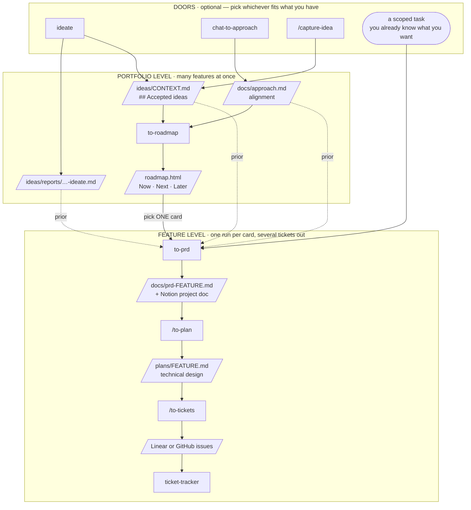

# Product workflow suite

Nine skills that take work from a raw idea (or an already-scoped task) through to tickets on a
board. This file is the map for humans working on the suite.

## Installing

Install all nine — the skills hand off to each other, so a partial install leaves those handoffs
dangling. (`artifact-scan` is the exception: every caller falls back to a one-line `ls`.)

```
for s in artifact-scan ideate chat-to-approach capture-idea to-roadmap to-prd to-plan to-tickets ticket-tracker; do
  npx skills add O-Marsters-1997/my-claude-code --skill "$s" -g -y
done
```

**This suite must stay at `skills/workflow/<name>/`.** The `skills` CLI discovers
`skills/<category>/<name>/SKILL.md` and nothing deeper. When the suite briefly lived at
`skills/product/workflow/<name>/` it was invisible to `npx skills add` — six of the eight silently
went uninstalled. Nesting one directory further to tidy things up breaks installation, with no
error to tell you.

The routines the suite calls (`../product/grilling`, `../product/source-synthesis`,
`../product/triage-issue`) install the same way.

**Keep every `description` a folded block scalar (`description: >`).** A plain one-line description
containing `": "` is invalid YAML, and a skill whose frontmatter won't parse is dropped from
`npx skills add --list` silently — no error, it simply isn't there. After editing a description:

```
grep -l '^description: [^>|].*: ' skills/*/*/SKILL.md   # must print nothing
```

---

**Skills must not reference this file.** Installation is flat — each skill lands in its own directory
under the agent's skills root, so `../README.md` does not resolve once installed, and the map would
be unreachable at exactly the moment it's needed. Every skill therefore carries its own `## Where
this sits` block: the same diagram, an arrow marking its position, and the two rules below. When the
shape of the suite changes, update this file *and* all eight blocks.

## The shape



Boxes are skills, slanted boxes the artifacts they write. Solid is the path; **dashed is an
optional prior** — it makes a stage faster and better-informed, never required. `/to-plan` and
`/to-tickets` are slash-only, so the spine is `to-prd` then whichever of the two you actually want.

## Two rules that explain everything else

**1. The spine runs per feature. The portfolio artifacts describe many features.**

`approach.md` and `roadmap.html` are portfolio-level: they hold every feature you're considering.
`to-prd`, `to-plan` and `to-tickets` handle exactly one feature per run.

A **roadmap card is a feature** — something that should be built — *not* a ticket. It is expected to
break down into several tickets, which happens at `to-tickets`, three stages later. `roadmap.html`
and the `ticket-tracker` board are different altitudes of the same work, not rival copies of it.

Crossing from portfolio to feature is a **fan-out, not a step**. A roadmap with six cards means six
independent spine runs, each ending in its own handful of tickets. When a spine skill is handed a
portfolio artifact as its source, its first job is to establish *which feature* — ask if it isn't
obvious.

**2. Nothing gates anything.**

Every skill runs standalone. Upstream artifacts make a stage faster and better-informed; they never
make it required. `to-prd` with an approach doc skips questions it can already answer; `to-prd` with
nothing runs the full interview. Both are correct uses.

This is deliberate. The suite is a set of loosely-coupled converters, not a pipeline with gates, so
that each stage can be iterated on alone as well as in sequence. Do **not** send a user backwards to
create a missing artifact — if they have what the stage needs, run the stage.

## The skills

| Skill | Level | Takes | Produces |
|---|---|---|---|
| `artifact-scan` | — | nothing | a report + one routing recommendation (also the preflight routine) |
| `ideate` | portfolio | the codebase | `./ideas/reports/YYYY-MM-DD-ideate.md`, `./ideas/CONTEXT.md` with `## Accepted ideas` |
| `chat-to-approach` | portfolio | a pasted conversation | `./docs/approach.md` |
| `capture-idea` | portfolio | one ad-hoc idea | a line in `## Accepted ideas` in `./ideas/CONTEXT.md` |
| `to-roadmap` | portfolio | `./docs/approach.md`, `## Accepted ideas`, or user list | `./roadmap.html` |
| `to-prd` | feature | anything above, or an interview | `./docs/prd-<feature>.md` + Notion 📜 Project Docs (or GitHub issue if requested) |
| `to-plan` | feature | a PRD | `./plans/<feature>.md` |
| `to-tickets` | feature | a plan | Linear or GitHub issues + optional treepad Batch Manifest |
| `ticket-tracker` | feature | GitHub issues | `status:*` label moves |

## Orchestrators vs routines

The suite-wide convention:

> A **user-invoked skill** orchestrates a workflow and may call **model-invoked routines**. A routine
> is not triggered directly by the user — it is delegated to from within another skill's flow.

Every skill in this directory is an orchestrator except `artifact-scan`, which is both (a front door
when the user asks, a preflight when a skill calls it). `to-plan`, `to-tickets` and
`capture-idea` are slash-only
(`disable-model-invocation: true`) — not every feature warrants both plan and tickets, and while
those two were model-invocable they collided on prompts like "break this PRD down into work";
`capture-idea` is gated because it otherwise collides with `ideate` on "give me an idea".

The routines these orchestrators call live **outside** this directory. They are not stages and never
appear in the map above:

| Routine | Called by | For |
|---|---|---|
| `../product/grilling` | `chat-to-approach`, `to-prd` | the canonical grilling loop — never re-inline it |
| `../product/source-synthesis` | nobody — run it yourself | the optional `## Background Research` section of `approach.md`; `chat-to-approach` only preserves it |
| `../product/triage-issue` | `ticket-tracker` | bug-driven tickets — a second door straight to the board, bypassing the spine |

## Not in scope

Implementation. The suite ends when tickets exist. The seam for later is `to-tickets` → `tdd`, with
the plan's technical design decisions as the constraint to check against.
